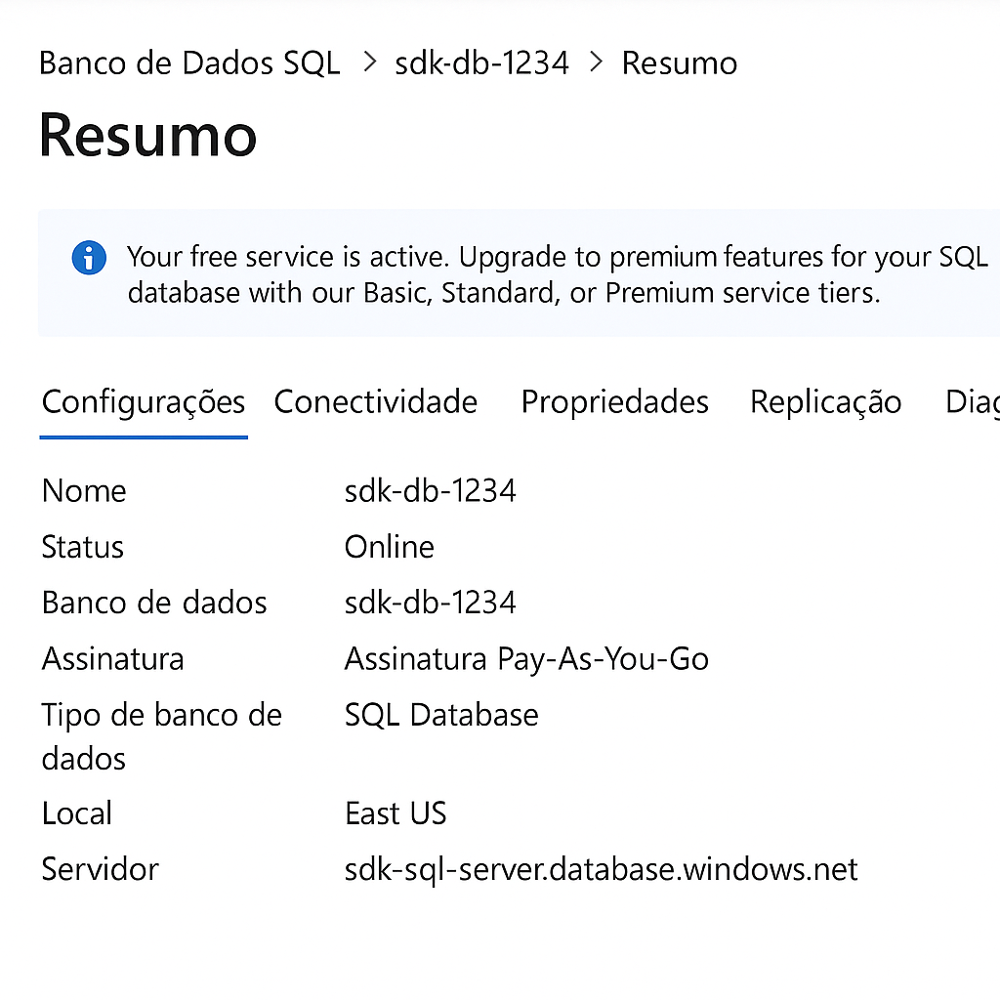

# Desafio Azure – Banco de Dados SQL

## Descrição do Desafio
Este repositório contém a documentação e os aprendizados adquiridos durante o laboratório de criação e configuração de uma instância de Banco de Dados SQL no Microsoft Azure. O objetivo foi consolidar os conceitos aprendidos e criar um material de apoio para futuras implementações.

## Objetivos
- Criar uma instância gerenciada de Banco de Dados SQL no Azure.
- Aplicar os conceitos de provisionamento e gerenciamento aprendidos nas aulas.
- Documentar o processo de forma clara e objetiva.

## Passos Realizados
1. Acesso ao Portal do Azure.
2. Criação da Instância Gerenciada de SQL.
3. Configuração do banco (nome, região, autenticação).
4. Definição das regras de firewall para acesso remoto.
5. Teste de conexão utilizando as credenciais criadas.

## Capturas de Tela

## Tecnologias Utilizadas
- Microsoft Azure
- Banco de Dados SQL Gerenciado

## Conclusão
Este laboratório reforçou a importância de gerenciar recursos em nuvem de forma organizada, com segurança e escalabilidade. O banco de dados criado pode ser utilizado para aplicações futuras e demonstra o conhecimento adquirido durante o treinamento.
